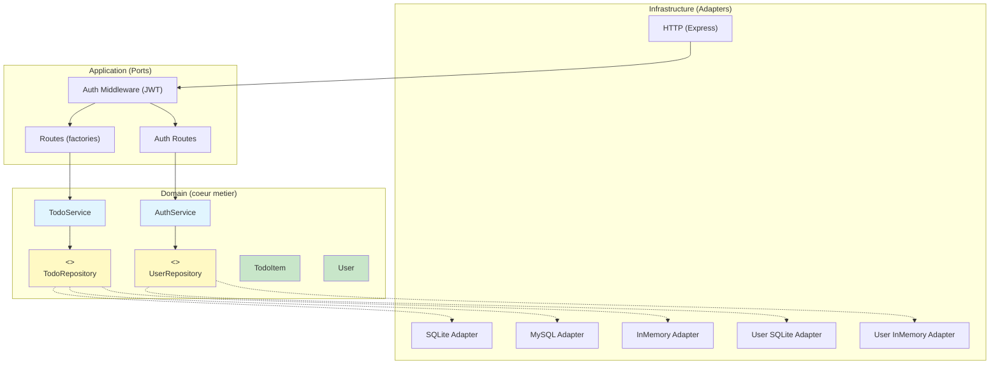
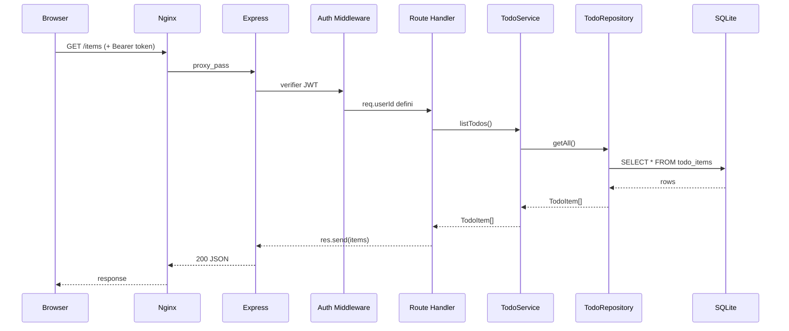
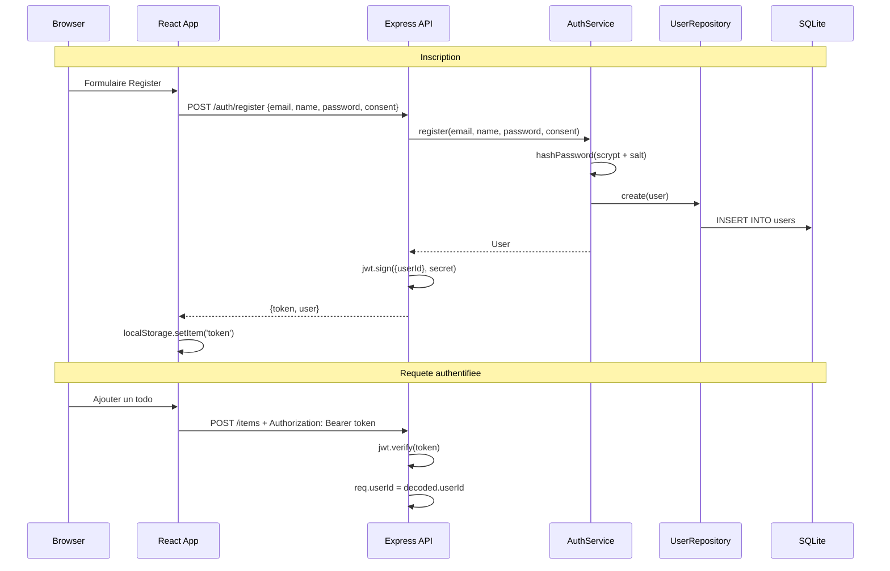
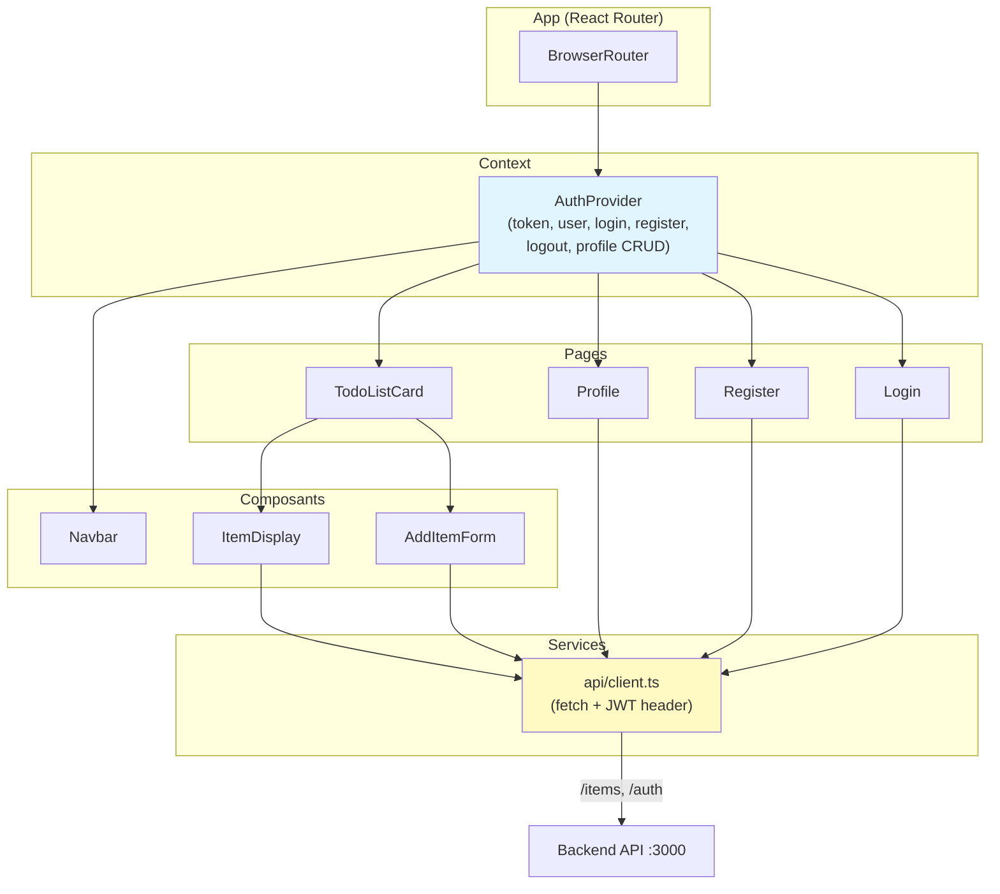

# Architecture technique — Todo App

## 1. Vue d'ensemble

```
┌──────────────────────────────────────────────────────────┐
│                    Docker Compose                         │
│                                                          │
│  ┌─────────────────────┐    ┌─────────────────────────┐  │
│  │     Frontend         │    │        Backend          │  │
│  │  (React+Vite+TS)     │    │    (Express+TS)         │  │
│  │                      │    │                         │  │
│  │  nginx:80            │───▶│  node:3000              │  │
│  │  /items ──proxy──▶   │    │  /items   /auth         │  │
│  │  /auth  ──proxy──▶   │    │                         │  │
│  └─────────────────────┘    └────────────┬────────────┘  │
│                                          │               │
│                                   ┌──────▼──────┐        │
│                                   │   SQLite    │        │
│                                   │  (volume)   │        │
│                                   └─────────────┘        │
└──────────────────────────────────────────────────────────┘
```

## 2. Architecture backend — Ports & Adapters



### Legende

| Couleur | Signification |
|---------|---------------|
| Bleu clair | Services (logique metier) |
| Jaune | Interfaces / Ports (contrats) |
| Vert | Entites du domaine |
| Gris (defaut) | Infrastructure / Adapters |

### Regle de dependance

Les fleches pointent toujours **vers le centre** (le domaine). Le domaine ne depend de rien d'exterieur :

```
Infrastructure ──▶ Application ──▶ Domain
     │                                ▲
     └────────────────────────────────┘
              (implemente les interfaces)
```

Cette regle est **enforcee automatiquement** par `dependency-cruiser` (`npm run lint:arch`).

## 3. Flux de donnees — Requete CRUD



## 4. Flux d'authentification



## 5. Architecture frontend — Composants React



## 6. Structure des donnees

### Table `todo_items`

| Colonne | Type | Description |
|---------|------|-------------|
| `id` | VARCHAR(36) | UUID v4 |
| `name` | VARCHAR(255) | Nom de la tache |
| `completed` | BOOLEAN | Etat de completion |

### Table `users`

| Colonne | Type | Description |
|---------|------|-------------|
| `id` | VARCHAR(36) | UUID v4 |
| `email` | VARCHAR(255) UNIQUE | Adresse email |
| `name` | VARCHAR(255) | Nom de l'utilisateur |
| `password_hash` | TEXT | Hash scrypt (salt:hash) |
| `created_at` | TEXT | Date ISO 8601 |
| `consent_given` | BOOLEAN | Consentement RGPD |

## 7. Composition Root (injection de dependances)

```typescript
// backend/src/index.ts (simplifie)

// 1. Choisir les adapters selon l'environnement
const todoAdapter = resolveAdapter();       // SQLite | MySQL | InMemory
const userAdapter = resolveUserAdapter();   // SQLite | InMemory

// 2. Creer les services avec injection
const todoService = createTodoService(todoAdapter);
const authService = createAuthService(userAdapter);

// 3. Assembler l'application
const app = createApp(todoService, { authService, enableAuth: true });

// 4. Initialiser et demarrer
await Promise.all([todoAdapter.init(), userAdapter.init()]);
app.listen(3000);
```

## 8. Tests — Couverture par couche

```
backend/spec/
├── integration/
│   ├── api.spec.js          # CRUD complet (InMemory, sans auth)
│   └── auth.spec.js         # Register, login, profil, delete, routes protegees
├── routes/
│   ├── addItem.spec.js      # Unit test (mock service)
│   ├── getItems.spec.js     # Unit test (mock service)
│   ├── updateItem.spec.js   # Unit test (mock service)
│   └── deleteItem.spec.js   # Unit test (mock service)
└── persistence/
    ├── inmemory.spec.js     # InMemory TodoRepository
    ├── sqlite.spec.js       # SQLite integration (real DB)
    ├── sqlite.unit.spec.js  # SQLite unit (full mocks)
    └── no-sqlite-in-test.spec.js  # Non-regression: isolation infra

frontend/e2e/
└── todo.spec.ts             # Playwright: register + CRUD complet
```

**Total : 67 tests backend (Jest) + 10 scenarios E2E (Playwright)**
