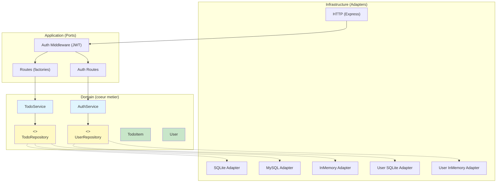
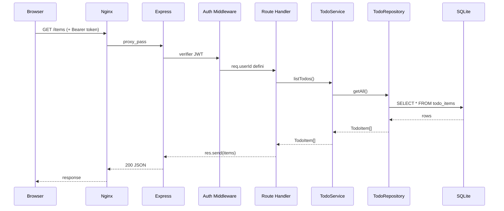
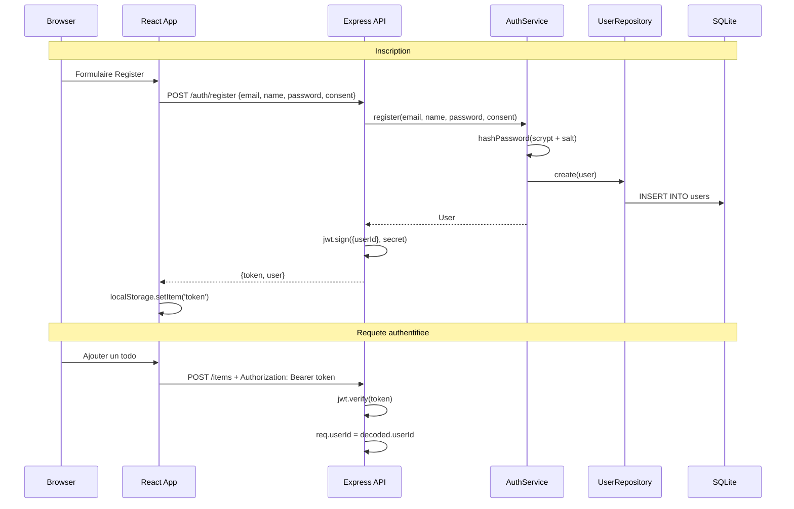
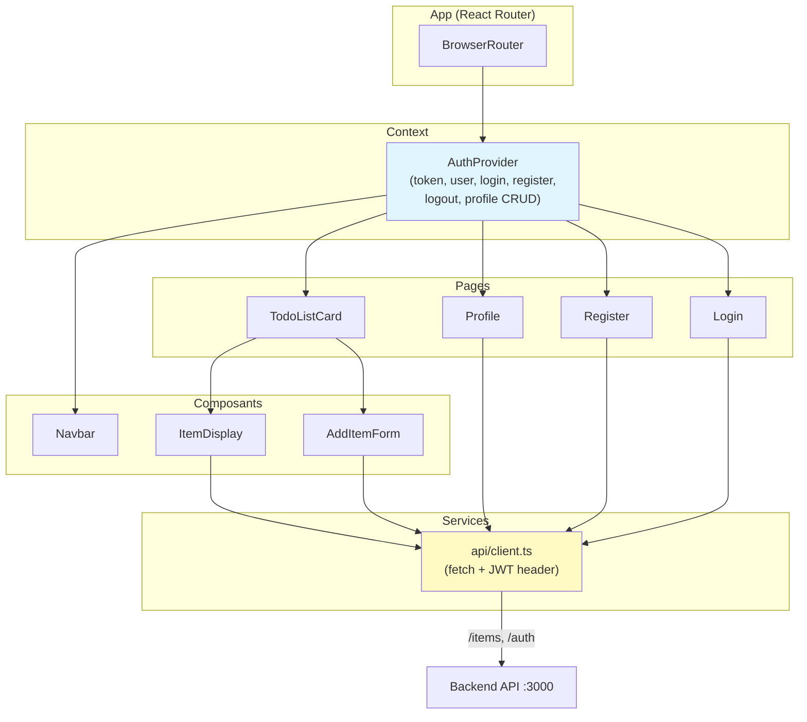
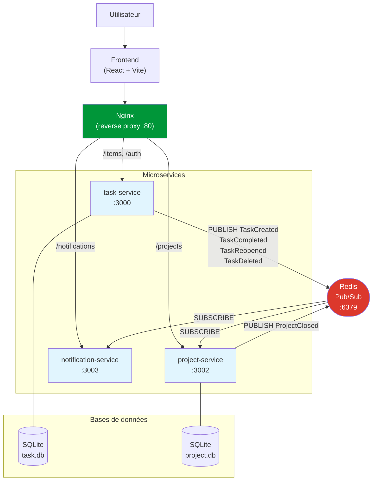
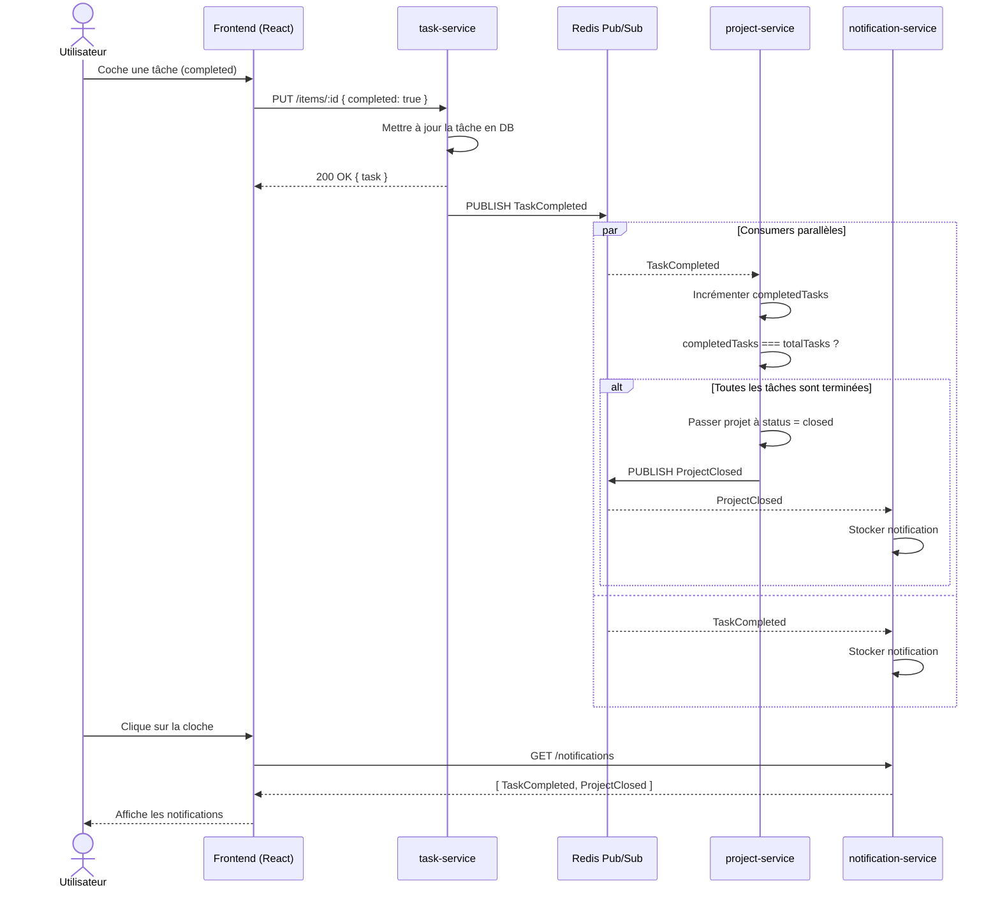
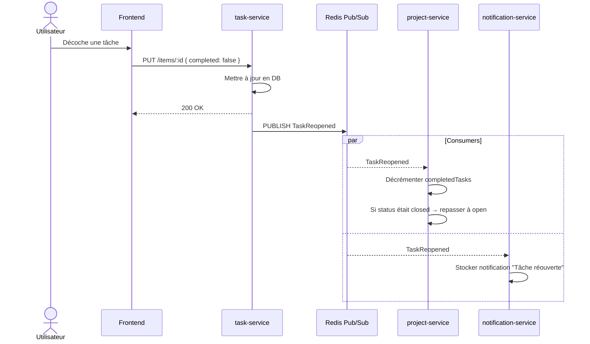
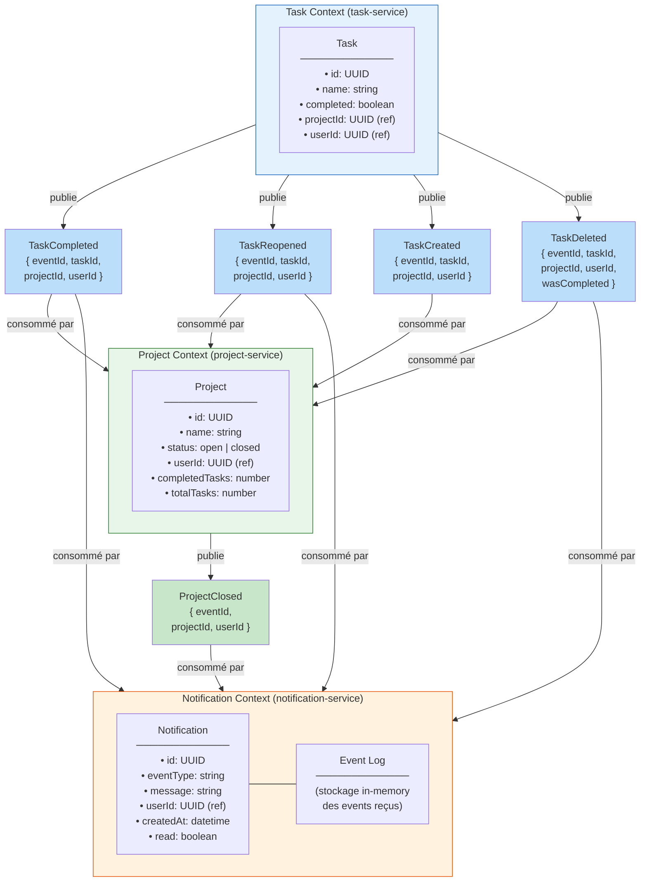

# Architecture technique — Todo App

## 1. Vue d'ensemble

```
┌──────────────────────────────────────────────────────────┐
│                    Docker Compose                         │
│                                                          │
│  ┌─────────────────────┐    ┌─────────────────────────┐  │
│  │     Frontend         │    │        Backend          │  │
│  │  (React+Vite+TS)     │    │    (Express+TS)         │  │
│  │                      │    │                         │  │
│  │  nginx:80            │───▶│  node:3000              │  │
│  │  /items ──proxy──▶   │    │  /items   /auth         │  │
│  │  /auth  ──proxy──▶   │    │                         │  │
│  └─────────────────────┘    └────────────┬────────────┘  │
│                                          │               │
│                                   ┌──────▼──────┐        │
│                                   │   SQLite    │        │
│                                   │  (volume)   │        │
│                                   └─────────────┘        │
└──────────────────────────────────────────────────────────┘
```

## 2. Architecture backend — Ports & Adapters



### Legende

| Couleur | Signification |
|---------|---------------|
| Bleu clair | Services (logique metier) |
| Jaune | Interfaces / Ports (contrats) |
| Vert | Entites du domaine |
| Gris (defaut) | Infrastructure / Adapters |

### Regle de dependance

Les fleches pointent toujours **vers le centre** (le domaine). Le domaine ne depend de rien d'exterieur :

```
Infrastructure ──▶ Application ──▶ Domain
     │                                ▲
     └────────────────────────────────┘
              (implemente les interfaces)
```

Cette regle est **enforcee automatiquement** par `dependency-cruiser` (`npm run lint:arch`).

## 3. Flux de donnees — Requete CRUD



## 4. Flux d'authentification



## 5. Architecture frontend — Composants React



## 6. Structure des donnees

### Table `todo_items`

| Colonne | Type | Description |
|---------|------|-------------|
| `id` | VARCHAR(36) | UUID v4 |
| `name` | VARCHAR(255) | Nom de la tache |
| `completed` | BOOLEAN | Etat de completion |
| `user_id` | VARCHAR(36) | Propriétaire de la tâche |
| `project_id` | VARCHAR(36) | Projet associé |

### Table `users`

| Colonne | Type | Description |
|---------|------|-------------|
| `id` | VARCHAR(36) | UUID v4 |
| `email` | VARCHAR(255) UNIQUE | Adresse email |
| `name` | VARCHAR(255) | Nom de l'utilisateur |
| `password_hash` | TEXT | Hash scrypt (salt:hash) |
| `created_at` | TEXT | Date ISO 8601 |
| `consent_given` | BOOLEAN | Consentement RGPD |

## 7. Composition Root (injection de dependances)

```typescript
// backend/src/index.ts (simplifie)

// 1. Choisir les adapters selon l'environnement
const todoAdapter = resolveAdapter();       // SQLite | MySQL | InMemory
const userAdapter = resolveUserAdapter();   // SQLite | InMemory

// 2. Creer les services avec injection
const todoService = createTodoService(todoAdapter);
const authService = createAuthService(userAdapter);

// 3. Assembler l'application
const app = createApp(todoService, { authService, enableAuth: true });

// 4. Initialiser et demarrer
await Promise.all([todoAdapter.init(), userAdapter.init()]);
app.listen(3000);
```

## 8. Tests — Couverture par couche

```
backend/spec/
├── integration/
│   ├── api.spec.js          # CRUD complet (InMemory, sans auth)
│   └── auth.spec.js         # Register, login, profil, delete, routes protegees
├── routes/
│   ├── addItem.spec.js      # Unit test (mock service)
│   ├── getItems.spec.js     # Unit test (mock service)
│   ├── updateItem.spec.js   # Unit test (mock service)
│   └── deleteItem.spec.js   # Unit test (mock service)
└── persistence/
    ├── inmemory.spec.js     # InMemory TodoRepository
    ├── sqlite.spec.js       # SQLite integration (real DB)
    ├── sqlite.unit.spec.js  # SQLite unit (full mocks)
    └── no-sqlite-in-test.spec.js  # Non-regression: isolation infra

frontend/e2e/
└── todo.spec.ts             # Playwright: register + CRUD complet
```

**Total : 67 tests backend (Jest) + 10 scenarios E2E (Playwright)**

---

## Architecture Microservices (Partie 2)

### Vue d'ensemble

La Todo App évolue vers une architecture **event-driven** composée de 3 microservices
indépendants, chacun avec sa propre base de données SQLite, communiquant via Redis
Pub/Sub (voir ADR-004).



### Description des 3 Bounded Contexts

**Task Service** — Source of truth des tâches. Expose un CRUD complet pour créer,
lire, mettre à jour et supprimer des tâches. Chaque tâche est associée à un `projectId`
(référence externe, sans connaissance du projet) et à un `userId`. Lorsqu'une tâche
passe à `completed: true`, le service **publie** un événement `TaskCompleted` sur
Redis. Lorsqu'elle repasse à `completed: false`, il publie `TaskReopened`. À la
création d'une tâche avec `projectId`, il publie `TaskCreated`. À la suppression,
il publie `TaskDeleted`. Ce service ne connaît pas l'existence du project-service
ni du notification-service.

**Project Service** — Source of truth des projets. Expose un CRUD complet pour gérer
les projets. Il maintient en local une **projection** (`completedTasks` / `totalTasks`)
mise à jour en écoutant les événements `TaskCreated`, `TaskCompleted`, `TaskReopened`
et `TaskDeleted` publiés par le task-service. Dès que `completedTasks === totalTasks`
(et `totalTasks > 0`), le projet passe automatiquement à l'état `closed` et le service
**publie** un événement `ProjectClosed` sur Redis. Ce service ne fait jamais d'appel
HTTP vers le task-service.

**Notification Service** — Consumer avec endpoint de lecture. Il **écoute** les
événements (`TaskCompleted`, `TaskReopened`, `ProjectClosed`, `TaskDeleted`), les
logue en console et les stocke en mémoire. Expose `GET /notifications` pour consulter
les notifications de l'utilisateur et `PUT /notifications/read` pour les marquer
comme lues.

---

### Diagramme de séquence — "Complete task → Project auto-close → Notification"



---

### Diagramme de séquence — "Reopen task → Project revient open"



---

## Bounded Contexts (DDD)



### Concepts partagés entre les contextes

| Concept | Task Context | Project Context | Notification Context |
|---|---|---|---|
| `projectId` | Référence externe (simple champ UUID) | Entité propre (aggregate root) | Donnée de contexte dans le payload |
| `userId` | Référence (propriétaire de la tâche) | Référence (propriétaire du projet) | Référence (destinataire notifié) |
| `taskId` | Entité propre (aggregate root) | Absent — projection locale uniquement | Donnée de contexte dans le payload |

### Parallèle avec l'exemple Sales/Support du cours

Dans le cours, `Customer` est un concept partagé entre les contextes Sales et Support :
du côté Sales, c'est un **prospect à convertir** (avec pipeline, devis, contrats) ;
du côté Support, c'est un **utilisateur avec des tickets** (avec historique, SLA).
Le même `customerId` est une référence dans les deux cas, mais l'entité est modélisée
différemment selon les besoins métier de chaque contexte.

Ici, `projectId` joue exactement ce rôle. Dans le **Task Context**, c'est un simple
champ UUID sur la tâche — une référence opaque vers un projet dont le task-service
ne sait rien (pas de relation FK, pas de JOIN). Dans le **Project Context**, c'est
l'identité de l'aggregate root `Project`, porteur d'un état (`status`), d'un nom,
et d'une projection locale (`completedTasks / totalTasks`). Chaque contexte possède
sa propre vision de `projectId`, cohérente avec ses responsabilités métier, et les
événements (comme `TaskCompleted`) servent de **pont entre les contextes** sans jamais
les coupler directement.

---

## Tableau récapitulatif des événements

| Événement | Producteur | Consommateurs | Payload clé |
|-----------|-----------|---------------|-------------|
| TaskCreated | task-service | project-service | taskId, projectId, userId |
| TaskCompleted | task-service | project-service, notification-service | taskId, projectId, userId |
| TaskReopened | task-service | project-service, notification-service | taskId, projectId, userId |
| TaskDeleted | task-service | project-service | taskId, projectId, userId, wasCompleted |
| ProjectClosed | project-service | notification-service | projectId, userId |

---

## Idempotence & Logs structurés

Chaque consumer (project-service et notification-service) implémente une garde d'idempotence :

- Un `Set<string>` stocke les `eventId` déjà traités
- Si un event arrive avec un `eventId` déjà vu → skip avec log `DUPLICATE`
- Le Set est cappé à 10 000 entrées (FIFO) pour éviter les fuites mémoire

Format des logs :
```
[2026-03-15T14:30:00.000Z] PUBLISHED TaskCompleted | eventId=abc-123 | subscribers=2
[2026-03-15T14:30:00.005Z] RECEIVED TaskCompleted | eventId=abc-123 | projectId=def-456
[2026-03-15T14:30:00.010Z] DUPLICATE TaskCompleted | eventId=abc-123 — skipping
```

---

## Tests — Couverture mise à jour (Partie 2)

```
services/task-service/spec/        68 tests Jest (unit + intégration)
services/project-service/spec/     14+ tests Jest (CRUD + auto-close)

frontend/e2e/
├── todo.spec.ts                   Tests CRUD tâches dans un projet
└── project-workflow.spec.ts       3 tests workflow complet :
    ├── create project → task → complete → auto-close → notifications
    ├── project stays open if not all tasks completed
    └── TaskReopened notification appears
```

**Total : 82+ tests backend (Jest) + 13+ scénarios E2E (Playwright)**
