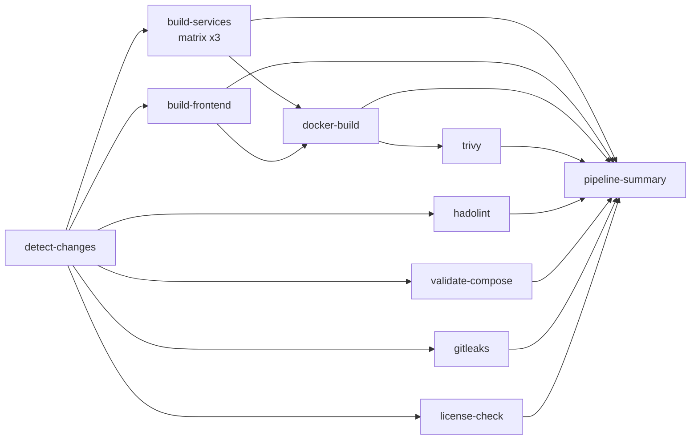

# CI/CD Pipeline

## Vue d'ensemble



## Pipeline principal (ci.yml)

Déclenchement : push sur `main`, `dev`, `feature/**` + PR vers `main` ou `dev`.

| Job | Description | Condition |
|-----|-------------|-----------|
| detect-changes | Détecte les services modifiés via git diff | Toujours |
| build-services | npm ci + audit + lint + tests + coverage | Par service modifié |
| build-frontend | npm ci + lint + build | Si frontend modifié |
| docker-build | Buildx multi-arch + push GHCR sur main | Après build |
| hadolint | Lint des 4 Dockerfiles | Toujours |
| validate-compose | Validation docker-compose.yml | Toujours |
| gitleaks | Scan secrets dans le code | Toujours |
| license-check | Vérification licences GPL/AGPL | Toujours |
| trivy | Scan images CRITICAL/HIGH → SARIF | Après docker-build |
| pipeline-summary | Tableau récap dans Step Summary | Toujours |

## Pipeline nocturne (nightly.yml)

Déclenchement : `cron 0 2 * * *` (2h du matin) + `workflow_dispatch`.

| Job | Description |
|-----|-------------|
| integration-tests | Tests Jest avec Redis service container |
| e2e-tests | Playwright complet avec tous les services |
| dependency-review | Vérification des nouvelles dépendances |

## Outils de sécurité

| Outil | Rôle | Niveau |
|-------|------|--------|
| npm audit | Vulnérabilités des dépendances | moderate+ |
| Gitleaks | Détection de secrets dans le code | Tout le repo |
| Trivy | Scan des images Docker | CRITICAL/HIGH |
| CodeQL | Analyse statique TypeScript | Hebdomadaire |
| license-checker | Licences incompatibles | GPL/AGPL |

## Registry GHCR

Images disponibles sur `ghcr.io/KarimHannaallah/Archi-logicielle` :

```bash
docker pull ghcr.io/KarimHannaallah/Archi-logicielle/task-service:latest
docker pull ghcr.io/KarimHannaallah/Archi-logicielle/project-service:latest
docker pull ghcr.io/KarimHannaallah/Archi-logicielle/notification-service:latest
docker pull ghcr.io/KarimHannaallah/Archi-logicielle/frontend:latest
```

## Lancer les checks en local

```bash
# Lint
npm run lint --workspaces --if-present

# Tests
npm test --workspaces --if-present

# Audit
npm audit --audit-level=moderate

# Vérifier docker-compose
docker compose config -q
```